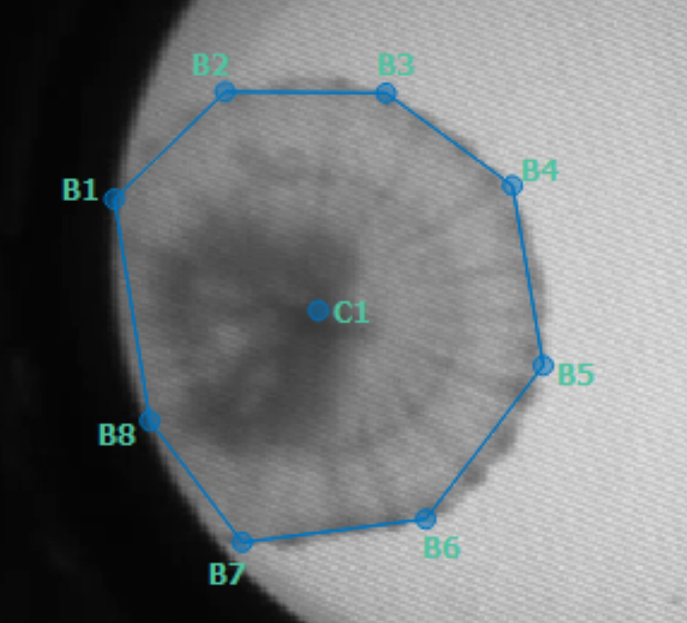

**1.) Intial Labeling**

Labeling was initalized by randomly generating 20 frames. For every randomly generated frame, each jelly was annotated such that 8 points (B1-B8) lie precisely on the circumference of the bell. C1 represents the center of the jelly's bell. The edges (connections between points) will not be factored in to tracked pulsation rates.

**2.) Model Training**

After annotating the first 20 randomly generated frames, the model was trained on these frames, and predicted positions on a new set of 20 randomly generated frames. 

Each new frame predicted was manually examined (Go -> Next Labeled Frame -> 'Score'). Where necessary, poses were re-annotated.

This cycle of training and predicting and updating ('human-in-the-loop') was continued until model could predict on unseen frames with confidence >90%. 

**3.) Model Components** 

The specific components of the model depend on which was selected for training. Here, we used the 'multi-animal top-down' approach, which first finds each jelly (center instance, C1), and then estimates the pose of each found jelly (B1-B8 on the circumference). The resulting model came in two parts: (1) centered instance, (2) centroid. Both are required as inputs for downstream inference.  

